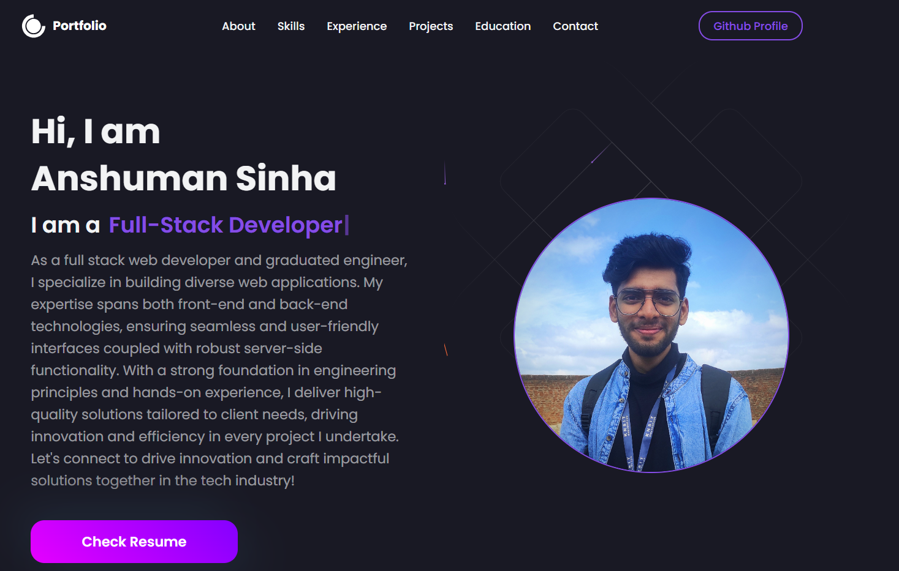

# Anshuman Sinha Portfolio

**[PORTFOLIO WEBSITE](https://anshumansinha2001.github.io/)**

## Overview

This is the personal portfolio of Anshuman Sinha, showcasing a collection of projects, skills, and experiences. Built using React, Material-UI, Styled Components, and various other plugins, the portfolio is designed to be visually appealing and user-friendly.

## Features

- **Responsive Design:** The portfolio is built with a responsive design, ensuring a seamless experience across various devices.
- **Material-UI:** Leveraging Material-UI components for a clean and modern user interface.
- **Styled Components:** Styling is implemented using Styled Components, providing a modular and maintainable styling approach.
- **Project Showcase:** Highlighting various projects with detailed descriptions, tech stacks, and live demos.
- **Skills Section:** Displaying a comprehensive list of skills and technologies mastered by Anshuman Sinha.
- **Contact Information:** Easy access to contact details, social media links, and other relevant information.

## Installation

To run this project locally, follow these steps:

1. Clone the repository: `git clone https://github.com/anshumansinha2001.github.io.git`
2. Navigate to the project folder: `cd anshumansinha.github.io`
3. Install dependencies: `npm install`
4. Start the development server: `npm start`

## License

This project is licensed under the [License](link-to-license).

## Contact

Feel free to reach out to me via email at anshumansinha2001@gmail.com or connect with me on [LinkedIn](https://www.linkedin.com/in/anshumansina2001)
